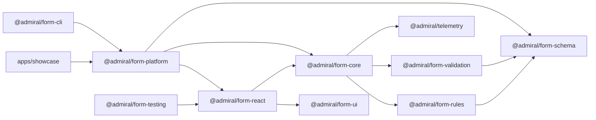

# Admiral Form Platform

`@admiral/form-platform` is a metadata-driven enterprise form framework for product squads that need complex, reusable, typed forms without reimplementing rendering, validation, rules, drafts, permissions, submission states, telemetry, and plugins in every application.

The solution is intentionally not a visual no-code builder. It is a frontend platform capability: a headless engine, typed schema, React adapter, UI foundation, rule engine, validation architecture, plugin model, CLI generator, example forms, Storybook, automated tests, and documentation suitable for multi-squad governance.

## Highlights

- Typed form schema with compile-time field ID assistance.
- Headless engine separated from React, routing, backend transport, Formik, React Hook Form, and UI vendors.
- Declarative rules engine with nested conditions, deterministic priority ordering, and dependency graph validation.
- Field registry with built-in fields and plugin-contributed field types.
- Sync, cross-field, form-level, warning, and async validation with debounce, cancellation, retry, pending state, and cache.
- Multi-step workflow with step-level validation, completed/error indicators, and review step support.
- Draft persistence with tenant/user/form/entity/version keys, expiration, restore, discard, and migrations.
- Explicit submission states for success, validation failure, conflict, unknown result, and failure.
- Remote data-source contract with search, pagination, loading, empty, error, cancellation, cache, and dependent options.
- Permission model in schema metadata instead of scattered JSX checks.
- Multi-tenancy through `FormPlatformContext`.
- Attachment, audit trail, and analytics plugins.
- CLI generator for new product forms.
- Storybook coverage for required states.
- Unit, integration, E2E, and performance-budget tests.
- English/Persian, LTR/RTL, dark mode, and accessible UI foundations.

## Quick Start

```bash
pnpm install
pnpm dev
```

The showcase runs the two required example forms:

- Shipment Booking Form
- Employee Onboarding Form

## Verification

Run the full submission check:

```bash
pnpm verify
```

Equivalent expanded commands:

```bash
pnpm build
pnpm typecheck
pnpm test
pnpm e2e
pnpm storybook:build
```

Useful focused commands:

```bash
pnpm test:platform
pnpm test:cli
pnpm storybook
pnpm e2e:ui
pnpm e2e:report
```

## Generate A New Form

```bash
pnpm generate invoice-request
pnpm generate:multi-step invoice-request
```

The generator creates a predictable feature folder:

```text
features/invoice-request/
├── invoice-request.form.ts
├── invoice-request.schema.ts
├── invoice-request.rules.ts
├── invoice-request.validation.ts
├── invoice-request.datasource.ts
├── invoice-request.fixture.ts
├── invoice-request.migrations.ts
└── invoice-request.test.tsx
```

## Basic Usage

```tsx
import { FormRenderer } from "@admiral/form-platform";
import { invoiceRequestForm } from "./features/invoice-request/invoice-request.form";
import { invoiceRequestFixture } from "./features/invoice-request/invoice-request.fixture";

export function InvoiceRequestPage(): JSX.Element {
  return (
    <FormRenderer
      definition={invoiceRequestForm}
      initialValues={invoiceRequestFixture}
      context={{
        tenantId: "tenant-a",
        userId: "user-42",
        locale: "en",
        timezone: "UTC",
        permissions: [],
        correlationId: crypto.randomUUID()
      }}
    />
  );
}
```

## Form Definition Example

```ts
import type { FormDefinition } from "@admiral/form-platform";

type BookingValue = {
  portOfLoading: string;
  portOfDischarge: string;
  cargoType: string;
  unNumber?: string;
};

export const bookingForm: FormDefinition<BookingValue> = {
  id: "shipment-booking",
  version: 1,
  title: { en: "Shipment Booking", fa: "رزرو حمل کانتینری" },
  sections: [
    {
      id: "route",
      title: "Route",
      fields: [
        { id: "portOfLoading", type: "select", label: "Port of loading", required: true },
        {
          id: "portOfDischarge",
          type: "select",
          label: "Port of discharge",
          required: true,
          validation: [
            {
              type: "notEqual",
              field: "portOfLoading",
              message: "Port of discharge must differ from loading port."
            }
          ]
        }
      ]
    },
    {
      id: "cargo",
      title: "Cargo",
      fields: [
        {
          id: "cargoType",
          type: "select",
          label: "Cargo type",
          options: [
            { value: "general", label: "General" },
            { value: "dangerous-goods", label: "Dangerous goods" }
          ]
        },
        {
          id: "unNumber",
          type: "text",
          label: "UN number",
          visibility: { field: "cargoType", operator: "equals", value: "dangerous-goods" },
          requiredWhen: { field: "cargoType", operator: "equals", value: "dangerous-goods" }
        }
      ]
    }
  ],
  steps: [
    { id: "route", title: "Route", sectionIds: ["route"] },
    { id: "cargo", title: "Cargo", sectionIds: ["cargo"] }
  ]
};
```

## Repository Structure

```text
apps/
└── showcase              # Vite showcase and Storybook stories
packages/
├── form-schema           # public typed schema and contracts
├── form-rules            # rules, conditions, graph, affected-field discovery
├── form-validation       # field registry and validation engine
├── form-core             # headless state engine, drafts, submission, plugins
├── form-react            # React adapter and renderer
├── form-ui               # accessible reusable UI primitives
├── form-platform         # public facade package
├── form-cli              # admiral-form generator
├── form-testing          # product-squad testing helpers
└── telemetry             # telemetry abstraction
docs/                     # detailed submission documentation
e2e/                      # Playwright journeys
```

## Architecture



Dependency direction points inward toward schema/core. Product teams should import from `@admiral/form-platform` and avoid deep imports from internal packages.

## Package Boundaries

| Package | Responsibility |
| --- | --- |
| `form-schema` | Typed schema, localized text, conditions, validation contracts, context, error model |
| `form-rules` | Declarative rule evaluation, dependency graph, topological ordering, affected fields |
| `form-validation` | Registry, schema validation, sync/async value validation |
| `form-core` | Headless state, subscriptions, drafts, submission, permissions, plugins, migrations |
| `form-react` | `FormRenderer`, React hooks, field rendering orchestration |
| `form-ui` | Inputs, select, radio, file, stepper, error summary, dialog, accessible primitives |
| `form-platform` | Public facade and built-in plugins |
| `form-cli` | `admiral-form generate` |
| `form-testing` | Render helpers for product teams |
| `telemetry` | Track, measure, and captureError abstraction |

## Feature Coverage

| Challenge Area | Implemented |
| --- | --- |
| Headless form engine | Yes |
| React rendering adapter | Yes |
| Typed schema definition | Yes |
| Field registry | Yes |
| Validation engine | Yes |
| Async validation | Yes |
| Conditional rules engine | Yes |
| Dependency graph | Yes |
| Calculated fields | Yes |
| Repeating groups | Yes |
| Multi-step forms | Yes |
| Draft persistence | Yes |
| Versioning and migrations | Yes |
| Optimistic concurrency conflict | Yes |
| Unknown submission result | Yes |
| Permission model | Yes |
| Multi-tenancy | Yes |
| Remote data sources | Yes |
| Plugin architecture | Yes |
| Attachment plugin | Yes |
| Audit trail plugin | Yes |
| Analytics plugin | Yes |
| Code generator CLI | Yes |
| Storybook | Yes |
| Automated tests | Yes |
| Architecture docs | Yes |
| AI usage docs | Yes |
| Known limitations and roadmap | Yes |

## Example Forms

### Shipment Booking

Includes customer, booking reference, route, dependent voyage options, cargo type, dangerous goods conditional fields, refrigerated cargo fields, repeating containers, charges, calculated total, attachments, conflict handling, unknown submission, draft restore, and review step.

### Employee Onboarding

Includes personal information, async national ID validation, employment information, department-dependent manager options, payroll permissions, equipment, emergency contacts repeating group, attachments, and review step.

## Validation And Rules

Validation precedence:

1. Schema required/type checks.
2. Field-level client validation.
3. Async/server-style field validation.
4. Form-level business validation.
5. Submission/server validation.

Rules support:

- nested `all` / `any`
- `equals`, `notEquals`, `greaterThan`, `lessThan`, `contains`, `in`, `isEmpty`, `isNotEmpty`
- show, hide, enable, disable, require, optional, clear, set default, warning, options
- deterministic priority ordering
- circular dependency rejection

## Drafts, Submission, And Conflict Handling

Draft key shape:

```text
tenant-a:user-42:shipment-booking:new:v2
```

Submission states:

- `idle`
- `validating`
- `submitting`
- `succeeded`
- `validation-failed`
- `conflict`
- `unknown`
- `failed`

Conflict state preserves user-entered values, displays server-changed fields, requires review, updates base values, and only then allows safe resubmission.

Unknown submission state stores the idempotency key, prevents duplicate submission, and allows status checking when a `checkStatus` adapter exists.

## Remote Data Sources

Remote option fields use a transport-independent data-source contract. The showcase demonstrates:

- search
- pagination
- loading state
- empty state
- error state
- cancellation
- tenant-aware cache keys
- dependency values

The Voyage field depends on port of loading and port of discharge; search filters by voyage code and label.

## Accessibility And I18n

Implemented:

- label association
- visible focus states
- required indicators
- accessible error summary
- focus first invalid field
- `aria-live` validation and submission feedback
- keyboard stepper and buttons
- non-color-only messages
- accessible file controls
- radio group semantics
- English and Persian labels/messages
- RTL layout
- locale-aware number/date/currency previews
- persisted locale in showcase local storage

## Performance

Performance budget:

- initial render below 500 ms
- single field interaction below 100 ms
- typical rule evaluation below 16 ms
- draft persistence must not block typing

Implemented strategies:

- field-level subscriptions
- affected-field discovery
- dependency-based recalculation
- debounced draft persistence
- debounced async validation
- request cancellation
- option caching
- memoized engine creation
- telemetry measurement points

The tests include a 150-field, 20-section, 50-rule performance scenario.

## Effort Estimate

Estimated production hardening beyond this assessment:

| Area | Estimate | Notes |
| --- | ---: | --- |
| Backend draft/submission adapters | 3-5 days | API contracts, retry policy, encrypted persistence, idempotency checks |
| Attachment upload pipeline | 3-4 days | Signed URLs, size/type enforcement, malware scanning, retention |
| Enterprise plugin certification | 2-3 days | Allowlist, lifecycle contract tests, compatibility matrix |
| Visual builder/editor | 2-4 weeks | Drag/drop authoring, schema diffing, preview, approval workflow |
| Governance and rollout | 3-5 days | Version policy, migration playbooks, ownership and support model |

## Security And Production Notes

Implemented safeguards:

- no `eval`
- no `new Function`
- normalized error model
- tenant-aware draft and cache keys
- sensitive values excluded from audit events
- permissions centralized in schema metadata

Production hardening should add:

- backend authorization
- schema and plugin allowlisting
- CSP
- CSRF protections
- encrypted draft storage
- retention policies
- attachment scanning
- signed upload/download URLs
- backend contract tests
- codemods for breaking migrations

## Documentation

Detailed documentation lives in [docs/index.md](./docs/index.md).

- [Getting Started](./docs/getting-started.md)
- [Architecture](./docs/architecture.md)
- [Authoring Forms](./docs/authoring-forms.md)
- [Schema Reference](./docs/schema-reference.md)
- [Rules and Validation](./docs/rules-and-validation.md)
- [Plugins](./docs/plugins.md)
- [Persistence and Submission](./docs/persistence-and-submission.md)
- [Testing](./docs/testing.md)
- [Accessibility and Internationalisation](./docs/accessibility-and-i18n.md)
- [Performance, Security, and Governance](./docs/performance-security-governance.md)
- [Technical Review Script](./docs/review-script.md)

AI-assisted engineering notes are documented in [AI_USAGE.md](./AI_USAGE.md).

## Storybook

```bash
pnpm storybook
pnpm storybook:build
```

Storybook includes required states for text, select, async select, currency, file, repeating group, conditional field, warning, validation error, multi-step, RTL, dark theme, read-only, permission restricted, conflict, draft restored, and unknown submission.

## Testing

```bash
pnpm test
pnpm e2e
```

Test coverage includes schema validation, duplicate fields, unknown dependencies, circular dependencies, topological ordering, rules, calculated values, cross-field validation, permissions, draft keys, tenant isolation, migrations, plugin behavior, conflicts, unknown submissions, repeating identity, generator behavior, and large-form performance.

## Governance

Recommended platform governance:

- public API through `@admiral/form-platform`
- no deep imports for product teams
- semantic versioning
- changelog and release notes
- deprecation policy
- migration guides
- compatibility tests
- canary adoption with product squads
- schema review process
- plugin certification
- security review for custom renderers and plugins
- documented ownership and support model

## Trade-Offs And Known Limitations

This implementation favors a compact, inspectable platform over full commercial form-builder depth.

Intentionally out of scope:

- visual drag-and-drop designer
- real backend draft API
- real cloud file upload
- antivirus scanning
- full automatic merge engine
- complete enterprise design system
- working codemod
- microfrontend runtime

## Roadmap

- Production draft API adapter.
- Real upload service integration.
- Schema registry and schema review workflow.
- Plugin certification pipeline.
- Performance benchmark dashboard.
- Codemod package for breaking schema changes.
- Backend contract test suite.
- Security hardening for production deployment.

## Useful Scripts

```bash
pnpm dev                 # run showcase
pnpm preview             # preview showcase build
pnpm build               # build all packages
pnpm typecheck           # typecheck all packages
pnpm test                # run all tests
pnpm test:platform       # run platform unit/integration tests
pnpm test:cli            # run generator tests
pnpm e2e                 # run Playwright journeys
pnpm storybook           # run Storybook
pnpm storybook:build     # build Storybook
pnpm generate my-form    # generate a basic form
pnpm generate:multi-step my-form
pnpm check               # build + typecheck + test
pnpm verify              # build + typecheck + test + e2e + storybook build
```
