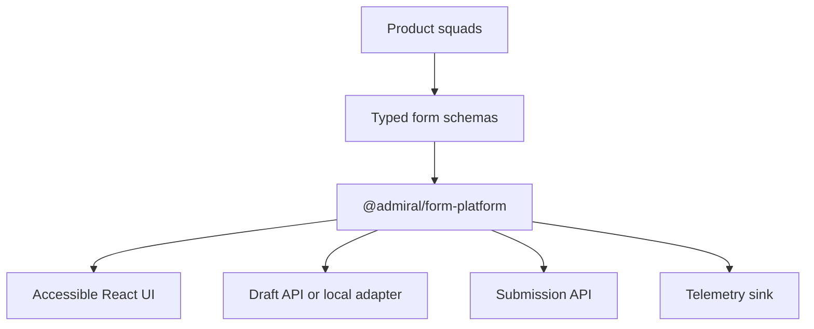
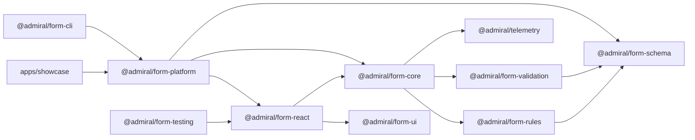
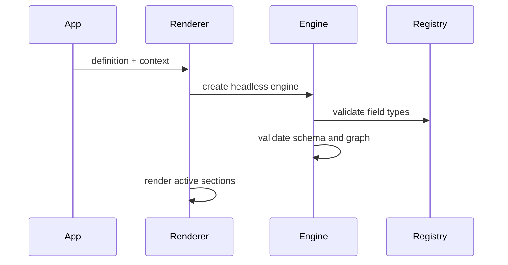
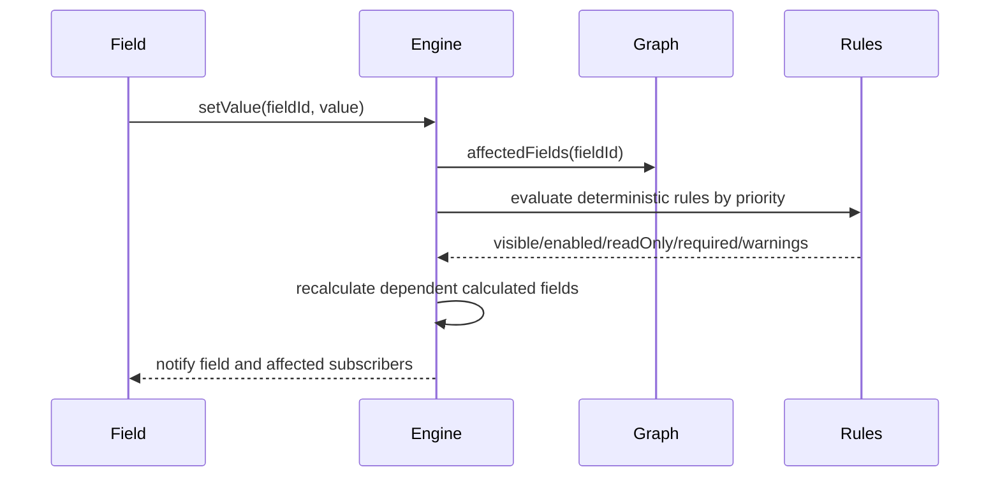
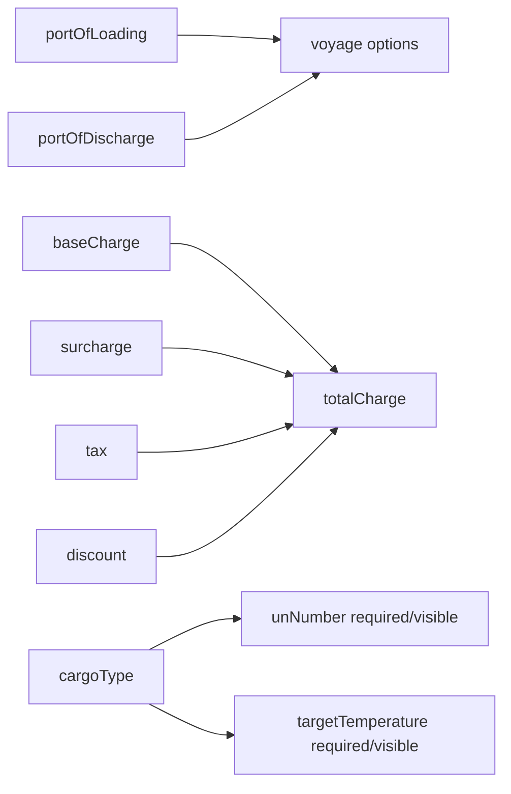
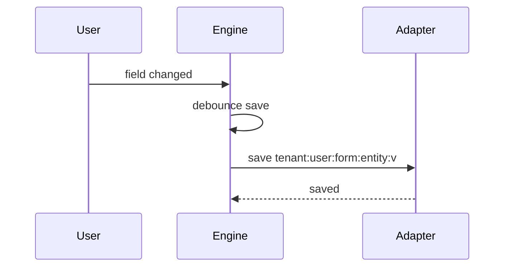
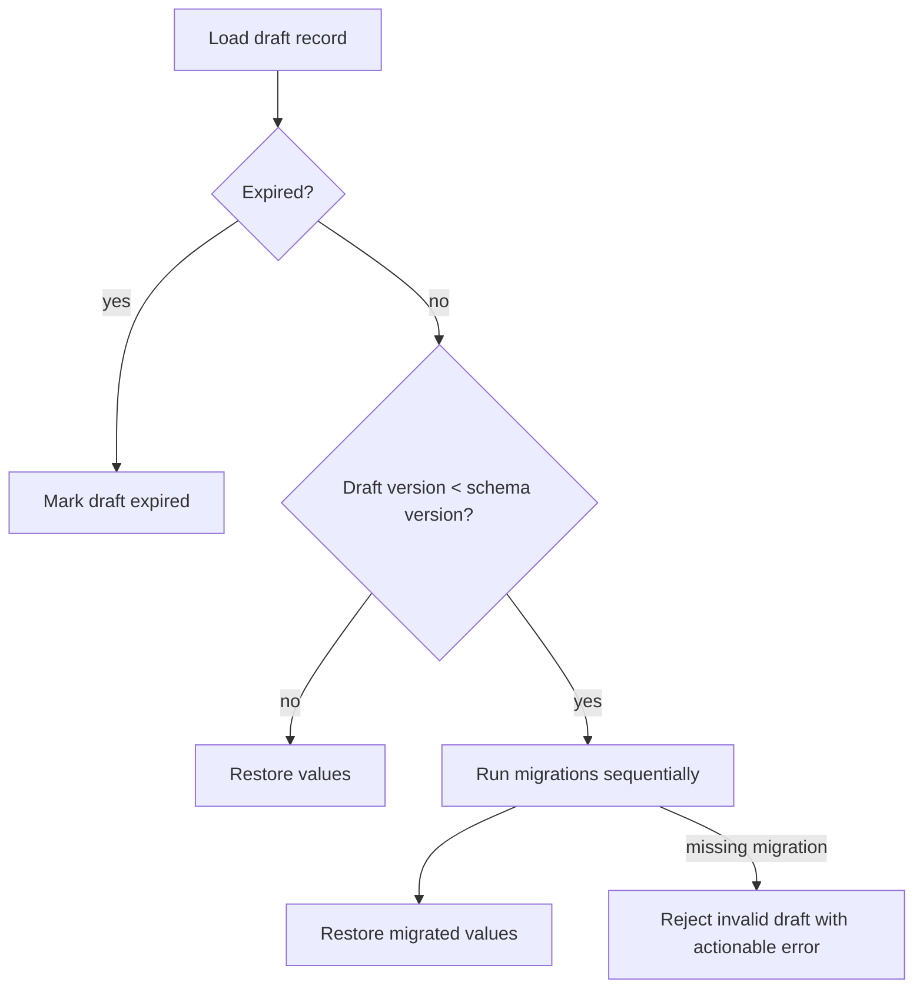
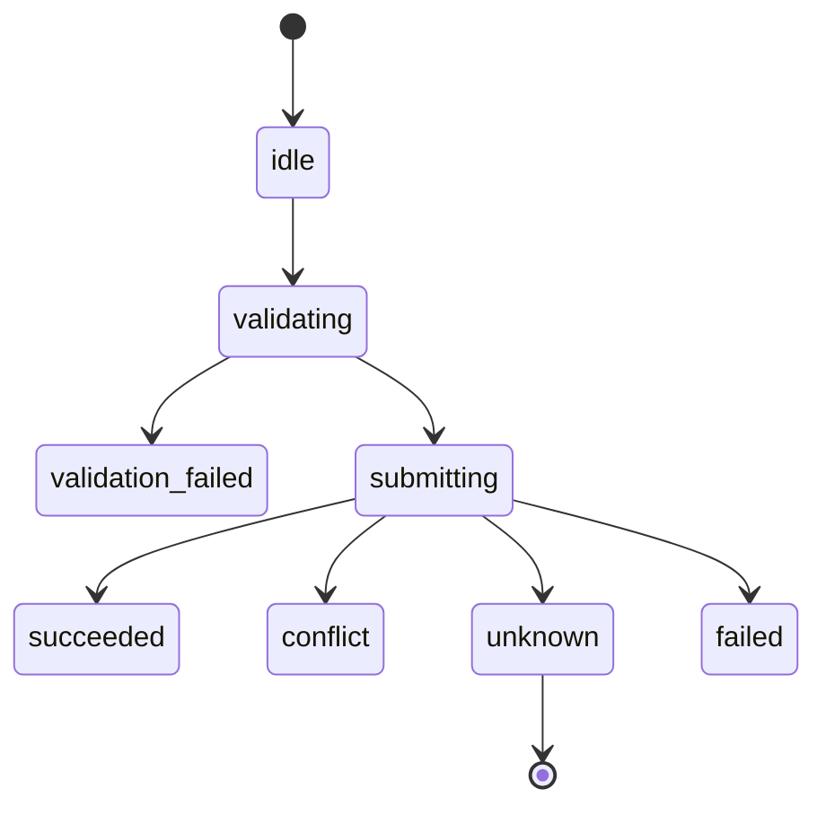
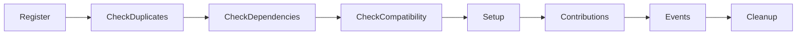
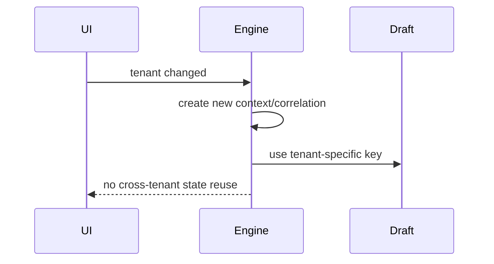

# Architecture

`@admiral/form-platform` is designed as a reusable frontend platform capability. Product teams define typed metadata; the platform handles engine state, rule evaluation, validation, rendering, drafts, permissions, submission states, telemetry, and plugins.

The architecture deliberately separates the headless engine from presentation and transport concerns. React, Vite, browser storage, and mock APIs are adapters around the core platform rather than public core dependencies.

## System Context

Product squads own product-specific schemas and business rules. Platform maintainers own the engine, public contracts, validation behavior, rendering adapter, UI primitives, generator, and governance.

## Package Dependency Diagram

## Rendering Flow

The renderer creates one engine instance per form definition, form version, tenant, and user. The engine validates schema and dependency graph before the UI renders the form. Invalid definitions fail fast with actionable errors.

## Rule Evaluation Sequence

## Dependency Graph Model

The engine builds edges from field dependencies, visibility/enabled/read-only/required conditions, calculated dependencies, remote data-source dependencies, and rule conditions. Topological ordering rejects direct and indirect cycles before rendering. Runtime updates use `affectedFields` so isolated field changes avoid full-form subscriber notifications.

## Draft Persistence

Draft persistence is adapter-based. The demo uses local and memory adapters; production should provide an authenticated API adapter with encryption, retention, authorization, and compatibility checks.

## Form Migration Flow

## Submission State

The explicit `unknown` state is important: if a request times out after being sent, the UI cannot safely assume failure. The engine stores the idempotency key and blocks duplicate submissions until status is checked or a safe retry path is available.

## Plugin Lifecycle

Plugins declare `id`, `version`, optional dependencies, compatible form versions, and minimum platform version. Duplicate IDs, missing dependencies, and incompatible versions are rejected before setup. Setup failures are captured through telemetry so one plugin cannot crash unrelated contributions.

## Tenant Switch

Tenant switching should create a fresh engine context. Draft keys, remote option cache keys, telemetry attributes, permissions, and data-source requests all include tenant context so tenant data is not reused accidentally.
